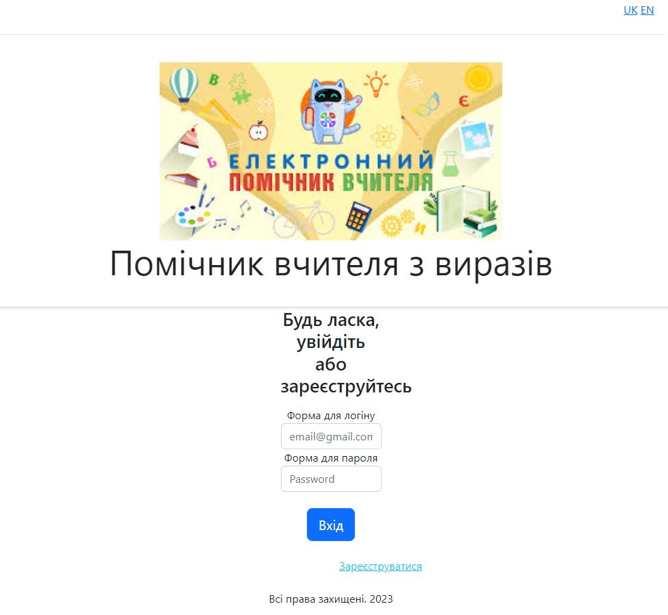

### Project type: web application (2 services + DB)

### Data flow:

Requirements: 
Тестове завдання для курсів Основи Java
Тестове завдання розраховане на визначення загального рівня володіння засобами мови Java. Припустимо часткове виконання задання.
Розробити застосування, яке допомагатиме вчителю математики.UserRepository
Застосування повинне надавати такі можливості:  
1. Вводити математичні рівняння, що містять числа (цілі, або десяткові дроби), а також математичні операції +, -, *, / та круглі дужки, рівень вкладеності дужок – довільний. У всіх рівняннях невідома величина позначається англійською літерою x. 
2. Перевіряти введене рівняння на коректність розміщення дужок. 
3. Перевіряти коректність введеного виразу (не повинно бути 2 знаків математичних операцій поспіль, наприклад, неприпустимий вираз 3+*4, в той же час, вираз 4*-7 є допустимим).
Приклади коректних рівнянь:
2*x+5=17 -1.3*5/x=1.2 
4. Якщо рівняння є коректним, зберегти його у БД. 
5. Надати можливість ввести корені рівняння, під час введення перевіряти, чи є задане число коренем, і якщо так – зберігати його в БД.  
6. Реалізувати функції пошуку рівнянь у БД за їхніми коренями.
   Наприклад, можливий запит: знайти всі рівняння, що мають один із зазначених коренів або знайти всі рівняння, які мають рівно один корінь.  
7. Проект має бути реалізований з використанням системи збирання Maven в одному із середовищ розробки: IntelliJ IDEA або Eclipse.
8. Проект має бути завантажений у репозиторій GitHub та надано
   посилання для його отримання. Також допустимо надіслати архів із проектом.
   Примітки.
   У роботі використовувати Java 11 чи 17.
   Рекомендується використання таких СУБД: MySQL, MariaDB чи PostgreSQL.
   Вітається використання JUnit та інших засобів тестування.
   Дозволяється використовувати файли (замість БД) для зберігання інформації про введені та редаговані рівняння.
   Обов'язковими для виконання є пп.1-3 та 8. Якщо п.4-7 не виконуються, виконати додаткове завдання: - Порахувати кількість чисел у рівнянні, введеному користувачем.

Solution:

Project ideas: 
●	A assistant for teacher 

Admin credentials: 
●	login: admin@gmail.com 
●	password: QAsQaqGMoG1K5hQCCVFd

To see available REST API endpoints, go to [http://localhost:8080/swagger-ui/index.html]() 
To see an application, go to [http://localhost:8081]()